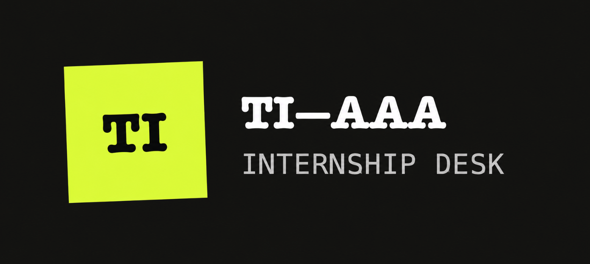

<p align="center">
  
</p>

<h1 align="center">TI-AAA</h1>

<p align="center">
  <strong>Tech Internship Autonomous Application Agent</strong>
</p>

<p align="center">
  <a href="https://github.com/Cole-Godfrey/ti-aaa/actions/workflows/ci.yml">
    
  </a>
  <a href="https://github.com/Cole-Godfrey/ti-aaa/actions/workflows/ci.yml">
    
  </a>
  <a href="pyproject.toml">
    
  </a>
  <a href="LICENSE">
    
  </a>
</p>

TI-AAA is a local app for tech internship applications. It runs in the background, checks fixed GitHub lists, reads each employer's real job posting to decide what is worth applying to, prepares truthful application files, and tracks submitted applications.

TI-AAA does not scrape LinkedIn, Indeed, Glassdoor, Google Jobs, or employer job catalogs. It opens only the direct application link a supported GitHub list already published — one page per listing, never a catalog crawl.

## Quick install

Install and start [Docker Desktop](https://www.docker.com/products/docker-desktop/), then run:

```bash
git clone https://github.com/Cole-Godfrey/ti-aaa.git
cd ti-aaa
docker compose up -d --build
```

Open [http://127.0.0.1:8787](http://127.0.0.1:8787), enter your profile, upload a PDF resume,
and connect your Claude account. See [Detailed Docker setup](#detailed-docker-setup) for the remaining
settings and operating instructions.

## Job sources

TI-AAA reads these repositories:

- [sndsh404/summer-2027-internships](https://github.com/sndsh404/summer-2027-internships)
- [vanshb03/Summer2027-Internships](https://github.com/vanshb03/Summer2027-Internships)
- [SimplifyJobs/Summer2026-Internships](https://github.com/SimplifyJobs/Summer2026-Internships)

## Deciding what to apply to

Every active listing gets one answer in the **Apply?** column: **Yes** or **No**. Select it to read
why.

Only listings posted within the last **2 days** are reviewed automatically, so a first sync does not
spend a model call on a repository's whole backlog — postings that old are usually past applying to.
Older rows stay in the table and say why they were skipped; **Re-check this listing** decides any one
of them on demand. Change the window, or set it to 0 to review everything, in **Settings**.

If a review run fails because Claude was unavailable, use **Retry today's reviews** in **Latest
jobs**. It selects only reviewable internships first discovered during your browser's current day
that still have no **Yes/No** answer. Existing decisions are preserved and are not sent through the
reviewer again; existing **Yes** answers still count toward the per-company application budget.

The decision is made from the employer's own job posting, not from the one-line summary in a GitHub
list. TI-AAA opens the direct application link, extracts the description, and asks Claude to decide.
It weighs:

- **The posting's real requirements** — required degree, graduation-date window, class year,
  citizenship, clearance, sponsorship, prior-intern-only restrictions, minimum experience. An unmet
  hard requirement is a **No** with the requirement quoted back to you.
- **Whether the role is still open.** A posting that says it is closed or filled is retired.
- **Genuine qualification match** against every resume you have uploaded, not against a keyword count.
- **A per-company application limit.** Large employers post many near-identical listings, and extra
  applications to the same company rarely add a real chance. TI-AAA reviews all of a company's open
  roles in one pass, ranks them against each other, and spends the limit (2 by default) on the best
  ones. Everything else is **No — limit already allocated**, said plainly rather than dressed up as a
  qualification problem. Applications you already submitted count against the limit, and so does a
  form the agent has filled but you have not yet confirmed — though the reasoning keeps those two
  apart and never claims you applied to something you have not. A role handed back for you to apply
  to yourself holds no slot. This limit is your own setting; the agent is told never to present it as
  an employer policy.
- **Timing.** A listing that has been open for weeks at a high-volume employer is deeper in the
  applicant pile than one posted yesterday.
- **Term, graduation date, and location** against your profile and preferences.
- **Duplicate listings** — the same role posted in several locations, or by several source lists.
- **Application cost** — long essays, assessments, and portfolio requirements are only worth it for a
  strong match.
- **Which resume to send**, chosen by name with a one-line reason.

Each decision records its confidence. **High** means the real posting was read and the deciding facts
were explicit in it; **low** means the employer blocked the read and only list metadata was available.

## Main rules

- The first sync imports the current jobs as a baseline.
- Automatic apply is off by default.
- Automatic apply considers only jobs that arrive after the baseline.
- Auto mode applies only to listings the review answered **Apply**. It never applies to an unreviewed
  listing.
- A manual **Apply** action ignores the decision, so you can always overrule a **No**.
- Cheap hard gates run before the review, so an obviously ineligible listing never costs a model call.
  The degree gate reads both the job title and the source list's advanced-degree marker, so a
  master's-, PhD-, or MBA-only role is filtered out for a bachelor's profile even when its title says
  nothing about a degree.
- Strict role and location filters drop listings before the review reads them.
- You can use preferences as an extra automatic application rule. This rule is off by default.
- A decision is re-made when its inputs change: a new listing at that company, an edited profile, a
  changed resume, or a decision older than the refresh window.
- New job batches stay in a visible queue. One browser applies to them in order.
- Some employers block the browser agent. Apply to those roles yourself, then record the submission with **I applied manually** in **Agent**. TI-AAA then counts the application and stops queueing that role.
- **Stop session** ends a running attempt at any point. The listing is recorded as stopped, leaves the queue, and is never claimed again automatically.
- By default, a manual application stops on the completed form for confirmation in **Agent**. You can opt into auto-submit for jobs you explicitly select.
- The agent completes and audits the form before TI-AAA starts a separate final-submission turn. It does not use the final Submit control to discover missing fields.
- Auto mode does not wait for user input. It submits safe applications and records why it stops others.
- Optional Web Push alerts report new Auto-mode jobs. They require Auto mode and browser permission.
- TI-AAA does not rewrite a resume. It submits an unchanged copy named `First_Last_Resume.pdf`.
- The service continues to work when the dashboard is closed.
- The computer and Docker must stay on.

## Features

- A local web app with guided setup
- An always-on Docker service
- A latest-jobs table whose **Apply?** column answers Yes or No for every listing, with the full
  reasoning one click away
- Employer job postings read directly from Greenhouse, Lever, Ashby, Workday, SmartRecruiters, and
  ordinary careers pages
- A per-company application budget so large employers do not absorb your applications
- Resume selection made by comparing every resume against the posting
- Degree, prior-intern, and work-authorization gates that read the source list's own markers
- Manual and automatic application modes
- An optional preference gate for automatic applications
- A visible serial application queue in the Agent tab
- Built-in browser alerts for new Auto-mode queue entries
- Multiple resumes with job-specific selection
- Byte-preserved application resume copies
- A live view of the browser worker
- Same-session browser control for manual CAPTCHA checkpoints—click, type, paste, and scroll without opening a second browser
- Input fields for agent questions
- A one-time-code input that continues the same open application and clears the code after use
- Final submission confirmation on the live completed form
- A **Stop session** control that ends the running browser attempt from the Agent tab
- A manual-application list in **Agent** for employers that block the browser agent and for sessions you stopped, with a one-click **I applied manually** record
- A **Mark applied** action on any Latest jobs row for roles you applied to yourself, with no browser agent run
- An application tracker that opens on submitted applications and can filter to **Confirm in Agent** checkpoints
- A clean Retry action for application checkpoints
- Resume records for each submitted application
- Application, online assessment (OA), interview, and offer statistics
- A welcome-back summary of applications and stopped Auto mode attempts
- A command-line interface (CLI) and a Python API

## Detailed Docker setup

Docker is the recommended setup. It includes Python, Chromium, Node.js, Claude Code, and the browser bridge.

### 1. Install Docker

Install [Docker Desktop](https://www.docker.com/products/docker-desktop/). Start Docker before you run TI-AAA.

### 2. Download and start TI-AAA

Run:

```bash
git clone https://github.com/Cole-Godfrey/ti-aaa.git
cd ti-aaa
docker compose up -d --build
```

The first build can take several minutes.

### 3. Open the web app

Open [http://127.0.0.1:8787](http://127.0.0.1:8787).

Complete these setup tasks:

1. Enter your profile and education facts.
2. Upload at least one PDF resume.
3. Connect your Claude account if you want browser automation.

Use **Connect Claude account** with a Claude Pro or Max account. You do not need an Anthropic API key for this method. An Anthropic API key is an optional alternative.

Enter your complete mailing address in **Settings**, including address line 1, ZIP/postal code,
city, state/region, county, and country. Address-suggestion forms cannot be completed truthfully from
city and state alone. If you have interned at an employer before, also list it under **Previous
internship employers** so returning-intern roles can be qualified correctly.

Claude subscription login is a Claude Code compatibility path. Anthropic may change or discontinue subscription login for this workflow in the future; if it stops working, use `ANTHROPIC_API_KEY` instead.

The first repository check creates the baseline. You can close the dashboard after setup. The Docker service continues to poll.

### 4. Set application rules

Open **Settings**. Use these controls:

- **Auto mode** turns unattended applications on or off. It is off by default.
- **Auto-submit manually selected applications** submits after an explicit **Apply** selection without requiring a second final-confirmation click. It is off by default.
- **Review new listings automatically** reads employer postings and fills the **Apply?** column. It is on by default.
- **Applications to spend per company** is the review's limit. Its default is 2.
- **Only review listings posted within** skips the older backlog. Its default is 2 days; 0 reviews everything.
- **Re-check a decision after** sets how long a decision stays current. Its default is 21 days.
- **Use my preferences as an application gate** can also require your role, location, and term preferences. It is off by default.
- **Notify this browser when new jobs enter the queue** appears only when Auto mode is on. Select it once, allow the browser prompt, then select **Save all settings**. It does not use email or SMS.
- **Daily application cap** limits submissions for one day.
- **Per-cycle cap** limits one poll cycle.

Auto mode submits only the roles the review answered **Apply** for, up to the per-company budget. It
does not ask for user input. If the employer page later reveals an unmet hard requirement, the agent
records that reason and the job is excluded from Auto mode. If a required personal fact is not
available, it stops the application and adds the reason to the next welcome-back summary. Manual
**Apply** actions ignore the decision.

Browser alerts work on `localhost` and use the browser's Web Push service. TI-AAA creates and stores the required keys in its private data volume. It does not ask you to configure a notification account or key.

### 5. Apply to a job now

Open **Latest jobs**. Select any **Apply?** answer to read the reasoning behind it, including which
resume the agent chose and why; **Re-check this listing** re-reads the posting and decides again.
Select a job, then select **Apply**. Open **Agent** to watch the browser and answer factual questions or paste a one-time verification code if an employer sends one. By default, review the completed form and select **Submit application**. If **Auto-submit manually selected applications** is enabled, the agent submits after completing the form without this second confirmation.

If an employer requires an ordinary email/password careers account, the agent creates it with the
profile email and a stable password unique to that careers portal. TI-AAA derives that password from a
private installation key; it does not reuse one shared password or store the generated plaintext.
Email/SMS codes and other 2FA still pause the account flow. Social sign-in is not automated.

The manual action does not require automatic apply, and it applies even to a listing the review answered **No**.

If the employer presents a CAPTCHA—or Submit stays disabled on **Submitting…** without producing a receipt—the manual application pauses with the exact Chromium tab still open. In **Agent**, use the live canvas to click the challenge, focus and type or paste into fields, and scroll. Select **Continue agent** when the challenge is clear or a receipt is visible. TI-AAA then inspects and continues that same page; it does not send you to a fresh job link or browser where the form state could be lost. Auto mode remains unattended and records CAPTCHA checkpoints as stopped attempts.

If a challenge keeps returning, or you finish the form yourself, you do not have to keep answering the
agent. **Stop session** on the worker card and on every Agent checkpoint ends that attempt: TI-AAA
closes the Claude turn and its browser, releases the listing, and records it as stopped instead of
queueing it again. A running turn stops within about a second; nothing waits for the agent timeout.

If an employer blocks the automated browser, or you stopped a session, that role moves to **Roles you apply to yourself** in **Agent**. Open the listing, complete the application in your own browser, then select **I applied manually**. TI-AAA records the submission with today's date, counts it in **Applications** and **Analytics**, and never queues that role for the browser agent again. The same action appears on the live-browser and employer-access-block checkpoint cards.

You can also record an application you submitted yourself before the agent ever touches the role. Every row in **Latest jobs** carries a **Mark applied** action, and the listing dossier repeats it as **I applied manually**. Selecting it records the same candidate-submitted application with today's date—no browser agent run, no Claude Code connection, and no onboarding requirement. The row stays in the repository inbox stamped **applied** and is never queued again. The action is hidden once a role is already applied, and it is unavailable while the browser agent is mid-application; stop that session first.

If a **Confirm in Agent** checkpoint needs to start over, open **Applications**, switch the filter to **Confirm in Agent**, and select **Retry**. TI-AAA closes any retained live form, clears pending checkpoint inputs, and queues a fresh browser attempt.

### Docker commands

Check the service:

```bash
docker compose ps
```

Read the logs:

```bash
docker compose logs -f tiaaa
```

Press `Ctrl+C` to close the log view. This does not stop TI-AAA.

Stop and start the service:

```bash
docker compose stop
docker compose start
```

Update TI-AAA:

```bash
git pull
docker compose up -d --build
```

`docker compose down` keeps the named data volume. `docker compose down -v` deletes the local TI-AAA data. Do not use `-v` unless you want this deletion.

## Native website setup

Use this setup if you do not want Docker.

You need:

- Python 3.11 or later
- Chrome or Chromium
- Node.js 22 or later
- Claude Code for browser automation

Create an environment and install TI-AAA:

```bash
git clone https://github.com/Cole-Godfrey/ti-aaa.git
cd ti-aaa
python3 -m venv .venv
source .venv/bin/activate
pip install -e .
```

On Windows PowerShell, use this activation command:

```powershell
.venv\Scripts\Activate.ps1
```

Install Claude Code if you want browser automation:

```bash
npm install -g @anthropic-ai/claude-code@2.1.226
```

Start the website and background service:

```bash
tiaaa serve
```

Open [http://127.0.0.1:8787](http://127.0.0.1:8787). The native app stores its data in `~/.tiaaa`.

## Terminal use

Create the local files:

```bash
tiaaa init --resume-pdf ./resume.pdf --resume-txt ./resume.txt
```

Edit these files:

```text
~/.tiaaa/profile.json
~/.tiaaa/settings.yaml
~/.tiaaa/.env
```

Check the setup and import the job lists:

```bash
tiaaa doctor
tiaaa sync
```

Run common tasks:

```bash
tiaaa jobs
tiaaa status
tiaaa review
tiaaa review --job-id 42
tiaaa prepare
tiaaa apply --job-id 42
tiaaa mark 42 --pipeline applied
tiaaa mark 42 --outcome oa
```

`tiaaa review` reads the employer postings for every company whose decisions are out of date.
`tiaaa review --job-id 42` re-decides that listing and the rest of its company.

`tiaaa mark <id> --pipeline applied` is the terminal equivalent of **I applied manually**: it records the
submission with the current time and marks it as candidate-submitted.

Run a continuous foreground worker:

```bash
tiaaa watch --apply
```

Final submission needs the local setting and the `--submit` option:

```yaml
automation:
  allow_submission: true
```

```bash
tiaaa watch --apply --submit
```

## Python API

Install the package in your environment:

```bash
pip install ti-aaa
```

Use the public API:

```python
from tiaaa.api import TIAAA

agent = TIAAA("./private-tiaaa-data")
agent.add_resume("./resume.pdf", name="Backend", tags=["backend", "python"])
agent.sync()

agent.review()

jobs = agent.jobs(limit=100)
job_id = jobs[0]["id"]
print(jobs[0]["apply_decision"], jobs[0]["apply_headline"])
agent.request(job_id)
agent.apply(job_id=job_id, submit=False)

print(agent.stats())
print(agent.analytics())
```

## Main settings

The web app manages these settings. Terminal users can edit `settings.yaml`.

```yaml
poll_interval_seconds: 300

service:
  enabled: true
  auto_prepare: true

review:
  enabled: true
  model: claude-opus-5
  max_applications_per_company: 2
  max_listing_age_days: 2
  fetch_postings: true
  refresh_after_days: 21
  max_companies_per_cycle: 12

automation:
  auto_apply_new: false
  manual_auto_submit: false
  auto_apply_use_preferences: false
  allow_submission: false
  max_applications_per_cycle: 5
  max_applications_per_day: 25

```

The dashboard does not show API key fields. Add optional secrets to the private `.env` file in the TI-AAA data directory, or pass them as environment variables.

For Docker, copy the example file in the repository. Then uncomment only the values that you need:

```bash
cp .env.example .env
```

Restart the container after you edit `.env`:

```bash
docker compose up -d
```

For a native install, add the same values to `~/.tiaaa/.env` and restart `tiaaa serve`.

These secrets are optional:

- `ANTHROPIC_API_KEY` for API-based Claude access. The posting review uses it when it is set and
  otherwise uses your connected Claude account, so a Claude Pro or Max subscription is enough.
- `GITHUB_TOKEN` for a higher GitHub request limit
- `OPENAI_API_KEY` or `GEMINI_API_KEY` for optional cover letters

## Data and safety

- Docker stores data in the `tiaaa-data` volume.
- Native mode stores data in `~/.tiaaa`.
- TI-AAA has no developer-operated server and sends no product telemetry.
- Repository sync sends requests to GitHub. A configured `GITHUB_TOKEN` is sent only to GitHub.
- The posting review requests the direct application link for each listing and sends the resulting
  description, your resumes, and your profile facts to Claude. It does not enumerate employer job
  catalogs and it rejects links that resolve to local or private-network addresses. Turn it off with
  **Review new listings automatically**, or keep decisions metadata-only by turning off the posting
  read.
- Claude browser automation receives the selected resume text, candidate profile, prepared answers, job metadata, and the generated per-portal account password. It interacts with the employer site, which receives the fields, files, and account credential entered for that application.
- During a manual CAPTCHA checkpoint, dashboard mouse and keyboard actions travel only through the local same-origin WebSocket to the retained Chromium tab. TI-AAA does not expose a remote navigation command or send the application URL to another browser.
- A one-time code entered in **Agent** passes through the active Claude browser session to the employer's code field. TI-AAA clears the stored local answer after that browser turn.
- Optional OpenAI, Gemini, or custom LLM preparation sends resume text and job metadata to the provider you configure.
- Optional Web Push sends the company and role in an encrypted notification through your browser vendor's push service.
- The dashboard binds to `127.0.0.1` by default.
- Do not expose the dashboard to the public internet without access control.
- If you use an authenticated reverse proxy, set `TIAAA_TRUSTED_HOSTS` to a comma-separated list of its public hostnames.
- Community internship lists and their outbound links are third-party data. TI-AAA rejects listed links that directly target local/private-network addresses, but you should review the sources and employers before enabling Auto mode.
- The agent does not invent candidate facts.
- Manual applications ask for unknown, ordinary candidate facts and can pause for a one-time code sent to the candidate's configured email address or phone.
- Auto mode does not ask for input. A missing required personal fact stops that application and is recorded. Add the fact in **Settings** and save: TI-AAA queues those stopped applications again on the next cycle.
- Auto mode can answer subjective questions and compensation questions without inventing candidate facts.
- One-time verification codes can be entered in the local Agent view and are cleared after the browser turn uses them. CAPTCHAs can be completed by the candidate in the retained live browser; TI-AAA does not solve or bypass them. Social SSO, non-code MFA, assessments, and identity checks still require a manual handoff.
- Required ordinary employer accounts use the candidate email and a deterministic password unique to the careers-portal hostname. The private derivation key is stored with local user-only permissions; the generated plaintext password is sent to the browser agent when needed but is not stored.
- The agent refuses payment, bank, government ID, and biometric requests.
- Application limits stay active in automatic mode.

Job applications have real effects. Check your facts, limits, employer rules, school rules, and local law.

## Development

```bash
git clone https://github.com/Cole-Godfrey/ti-aaa.git
cd ti-aaa
python3 -m venv .venv
source .venv/bin/activate
pip install -e '.[dev]'
pytest
ruff check src tests
python -m build
```

Read [CONTRIBUTING.md](CONTRIBUTING.md) before you open a pull request. Read [SECURITY.md](SECURITY.md) to report a security problem.

## Credit

TI-AAA uses ideas and application workflow patterns from [ApplyPilot](https://github.com/Pickle-Pixel/ApplyPilot) by [Pickle-Pixel](https://github.com/Pickle-Pixel). ApplyPilot introduced the open-source pipeline concept, SQLite tracking, and the Claude Code and Playwright application workflow that informed this project.

TI-AAA is a separate project. It is not endorsed by ApplyPilot or by the internship-list maintainers. See [NOTICE](NOTICE).

## License

TI-AAA uses the [GNU Affero General Public License v3.0](LICENSE).
